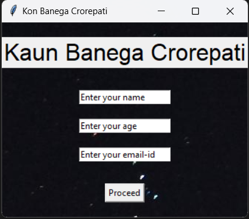

# Kaun Banega Crorepati Game

An interactive quiz game based on the popular Indian television show, "Kaun Banega Crorepati" (KBC), built using Python and the `tkinter` GUI library.

## Details

This application is implemented in Python and uses several external libraries for its functionalities. To run the game, you'll need to ensure you have the required modules installed.

### Modules to Install:

pip install pygame Pillow

## Features

- **Interactive GUI**: Offers a user-friendly graphical interface with easy-to-click buttons and intuitive layouts.
- **Dynamic Question Loading**: Loads questions randomly from a set ensuring each game session feels unique.
- **Lifelines**: Features like "50-50" and "Ask the Audience" lifelines are integrated, similar to the original game.
- **Timer**: A countdown timer enhances the challenge for each question based on its difficulty level.
- **Audio Feedback**: Utilizes the `pygame` library to provide audio feedback for correct and incorrect answers.

## Getting Started

To get a local copy up and running, follow these steps:

1. Clone the repository: git clone https://github.com/Bisalkumar/Quiz-KBC-.git
2. Navigate to the project directory: cd KBCGame
3. Install the required modules: pip install -r requirements.txt
4. Run the game: python kbc_gui.py

## How to Use

1. **Start Screen**: Enter your name, age, and email to begin.
2. **Instructions**: Read the game instructions and proceed.
3. **Gameplay**: Answer the questions using the provided options and utilize lifelines when needed.
4. **End**: The game ends either when you answer a question incorrectly or when you've answered all questions.

## Screenshots

## Contributions

Pull requests are welcome. For major changes, please open an issue first to discuss what you'd like to change.

## License

This project is licensed under the MIT License - see the [LICENSE.md](LICENSE.md) file for details.

## Acknowledgements

- Thanks to the creators of "Kaun Banega Crorepati" for the inspiration.
- `pygame` and `tkinter` libraries for enabling the game's GUI and audio features.
- The community for continuous support and contributions.
